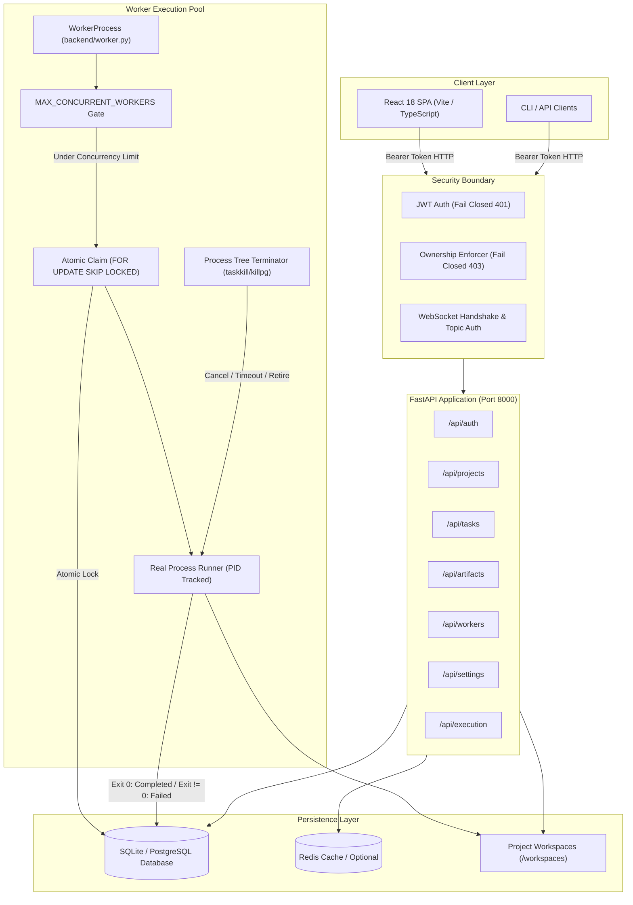

# NEXUSFORGE — GROUND-TRUTH ARCHITECTURE REALITY

**Document Version:** 2.0 (Post-Remediation Reality)  
**Verification Date:** 2026-09-13  
**Auditor:** Senior Staff Architect & Security Engineer  
**Branch:** `security/forensic-remediation`  

---

## 1. System Overview & Reality Demarcation

This document defines the strict, ground-truth architectural reality of the NexusForge codebase as verified through static code analysis, unit tests, integration tests, and live process execution.

### 1.1. What Actually Works and Is Verified
1. **FastAPI Application & REST Endpoints:**
   - Database-backed authentication (JWT Bearer tokens, bcrypt password hashing, fail closed).
   - Multi-tenant Project, Task, and Artifact CRUD with strict ownership enforcement (`enforce_ownership`).
   - User-scoped API key management with superuser gating on system configuration.
   - Real-time Execution Monitor with authenticated WebSocket subscriptions.
   - Disabled general-purpose host terminal execution (fails closed with 403 Forbidden).
2. **Database Persistence:**
   - SQLAlchemy 2.0 async engine supporting SQLite (`sqlite+aiosqlite`) and PostgreSQL (`asyncpg`).
   - Unified declarative models in `app.models` and schema contracts in `app.schemas`.
3. **Background Worker Engine (`backend/worker.py`):**
   - Independent background worker process connecting to database and registering in `workers` table.
   - Periodic database heartbeat tracking.
   - **Race-Safe Atomic Claiming:** PostgreSQL `FOR UPDATE SKIP LOCKED` and conditional SQL updates prevent duplicate task execution.
   - **Real Concurrency Gate:** Active running tasks checked against `MAX_CONCURRENT_WORKERS`.
   - **Real Process Execution:** Executes commands via `asyncio.create_subprocess_exec` / `subprocess.run` (with `shell=False`, directory containment, PID tracking, and stdout/stderr capture).
   - **Fail-Closed Execution:** Exit code 0 marks task `completed`. Non-zero exit code marks task `failed`. Missing runtime marks task `failed`. Zero fake sleep loops.
   - **Real Process Control:** `ExecutionMonitor` tracks process PIDs and executes tree termination on cancellation, timeout, or worker retirement.
4. **Single-Page Application Frontend (`src/`):**
   - React 18 with TypeScript and Vite.
   - Builds cleanly with 0 compilation errors (`npm run build` -> Exit code 0).
   - Fail-closed route protection (`ProtectedRoute` validates token against `/api/auth/me`).
   - Clean UI: All fabricated 12-agent personas and canned metrics removed. Displays real task execution status, real traces, or proper empty states.

### 1.2. What Does NOT Exist (Purged)
1. **Fabricated 12-Agent Squad Theatre:**
   - The ~1,100 lines of `_execute_autonomous_squad` and `autonomous_forge.py` simulating multi-agent conversations with `asyncio.sleep()` and producing hardcoded 98/100 code scores have been **completely purged**.
2. **Hardcoded Mock Telemetry:**
   - Canned worker cards with fabricated 99.99% uptime and fake RAM have been **removed**. The system reports actual connected worker instances or clean empty states.
3. **General-Purpose Terminal Execution:**
   - The unauthenticated, unrestricted `shell=True` execution vector has been **eliminated and disabled**.

---

## 2. Component Topology & Data Flow

---

## 3. Data Model Canonical Architecture

All database entities are mapped using SQLAlchemy declarative models in `app.models`:
- **`User`**: `id` (UUID), `email`, `username`, `password_hash`, `is_active`, `is_superuser`, `created_at`, `updated_at`.
- **`Project`**: `id` (UUID), `name`, `description`, `owner_id` (FK -> `users.id`), `status`, `workspace_path`, `created_at`.
- **`Task`**: `id` (UUID), `project_id` (FK -> `projects.id`), `title`, `description`, `role`, `status`, `priority`, `acceptance_criteria` (JSON), `assigned_worker_id` (FK -> `workers.id`), `started_at`, `completed_at`.
- **`Worker`**: `id` (UUID), `worker_id` (String unique), `hostname`, `status` (`idle`, `busy`, `paused`, `retired`, `offline`), `current_task_id`, `last_heartbeat`, `skills` (JSON).
- **`Artifact`**: `id` (UUID), `project_id`, `task_id`, `name`, `type`, `path`, `size`, `mime_type`, `created_at`.
- **`UserAPIKey`**: `id` (UUID), `user_id`, `provider`, `api_key`, `model`, `is_active`.

All Pydantic schema validation contracts reside exclusively in `app.schemas` (`user.py`, `task.py`, `project.py`, `worker.py`, `artifact.py`).

---

## 4. Execution Lifecycle & Fail-Closed Guarantee

1. **Queuing:** Task is created with status `queued` in the database under an authenticated user's project.
2. **Concurrency Gate:** Worker verifies active executions < `MAX_CONCURRENT_WORKERS`.
3. **Atomic Claiming:** Worker claims the task using atomic SQL update or `FOR UPDATE SKIP LOCKED`.
4. **Execution:**
   - Command is launched as an isolated subprocess with `shell=False` in the project's resolved workspace directory.
   - ExecutionMonitor registers the OS process PID for real cancellation and timeout control.
   - If runtime is unavailable and no command is provided, execution **fails closed immediately**.
5. **Resolution:**
   - Process returns 0: Task status set to `completed`, artifacts indexed, monitor marked complete.
   - Process returns non-zero: Task status set to `failed`, error message captured, monitor marked complete with error.
   - Worker returns to `idle` state and awaits the next task.
